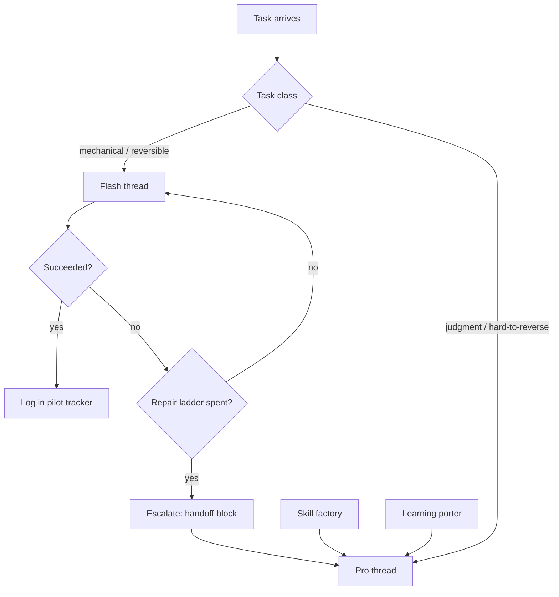

# Agent Cost Optimization: Tiered Routing + Skill Factory + Learning Porter

**Status:** Implemented
**Owner:** Eliseo
**Created:** 2026-08-15
**Updated:** 2026-08-15 (requirements + design approved at review gates)

## Context

DeepSeek raised prices: from 2026-08-16 16:00 UTC, billing switches to
peak/off-peak rates that are up to ~4.7× the previous flat prices. The
goal is to reduce AI spend by running routine agent work on the cheap
tier (`deepseek-v4-flash`) and reserving the expensive tier
(`deepseek-v4-pro`) for judgment-heavy work. Two meta-agents support
this:

1. **Skill factory** — creates new super-specific agent skills from
   evidence, so tasks stay narrow enough to be safe on Flash.
2. **Learning porter** — moves session learnings across repos so every
   correction pays once, not once per project.

Existing infrastructure this builds on (all already in place):

- `zed/profiles.json` — per-role model config (`default` / `heavy`)
- Role-based skills in `skills-test/.agents/skills/` — the existing
  "super-specific agents"
- Shared learnings pool: `skills-test/AGENTS.md` §10 (generic rules) +
  per-repo §10 (project-specific rules)
- Retro pipeline: session logs → retros in `specs/memories/`
- Token/cache-hit telemetry + cost-budget mechanism owned by the
  `ai-engineer` skill

## Verified Pricing (source: api-docs.deepseek.com/quick_start/pricing, fetched 2026-08-15)

Per 1M tokens. New rates are operative from **2026-08-16 16:00 UTC**.
Peak hours: **01:00–04:00 and 06:00–10:00 UTC** (7h/day); all other
hours are off-peak (17h/day).

| Price (per 1M tokens) | Flash off-peak | Flash peak | Pro off-peak | Pro peak |
|---|---|---|---|---|
| Input (cache hit) | $0.007 | $0.014 | $0.022 | $0.044 |
| Input (cache miss) | $0.22 | $0.44 | $0.66 | $1.32 |
| Output | $0.66 | $1.32 | $1.98 | $3.96 |

Previous flat rates (for baseline comparison): Flash $0.0028 hit /
$0.14 miss / $0.28 output; Pro $0.003625 hit / $0.435 miss / $0.87
output.

Facts that shape the design:

- Pro ≈ 3× Flash on every price.
- Cache hit ≈ 31× cheaper than cache miss on Flash off-peak
  ($0.007 vs $0.22). Stable prompt prefixes (AGENTS.md + skills) are
  the single biggest lever after routing.
- Both tiers: 1M context, 384K max output, JSON output, tool calls,
  thinking mode (default on). Flash concurrency 2500, Pro 500.
- Peak is 7h/day in UTC — whether peak overlaps local working hours
  matters for the pilot measurement (see US4).

## Model IDs (verified 2026-08-15)

- **DeepSeek API model IDs:** `deepseek-v4-flash`, `deepseek-v4-pro`
  (base URL `https://api.deepseek.com`, OpenAI format).
- **Zed:** DeepSeek is a first-class API provider (`DEEPSEEK_API_KEY`);
  custom models are declared in `settings.json` under
  `language_models.deepseek.available_models` (Zed docs use exactly
  `deepseek-v4-flash` / `deepseek-v4-pro` as the example, 1M context,
  384K output). Model references use
  `{"provider": "deepseek", "model": "deepseek-v4-flash"}`.
- **Our `zed/profiles.json`** is a custom registry (its schema differs
  from Zed's native `agent.profiles`). Design maps it: `default` →
  flash tier, `heavy` → pro tier, with a Zed `settings.json` snippet
  provided for the user to apply.

## Resolved Decisions (review gate, 2026-08-15)

1. "Heavy" becomes **DeepSeek V4 Pro everywhere** — Claude Opus is
   dropped from all profiles.
2. Pilot measures with **verified prices** (table above), not tokens
   alone.
3. "Other projects" **includes repos outside noir-hq**; the porter
   writes paste-ready export files inside skills-test (it cannot write
   outside the repo boundary).
4. Model IDs resolved as above.

## Requirements

### User Story 1: Tiered model routing

As the system operator, I want a routing policy that runs routine,
reversible agent work on the Flash tier and reserves the Pro tier for
judgment-heavy, hard-to-reverse work, so that total AI spend drops
without a drop in output quality.

**Acceptance Criteria:**

- Given any role profile in `zed/profiles.json`, When I inspect it,
  Then `default` is the Flash-tier model, `heavy` is the Pro-tier
  model (DeepSeek only — no Claude Opus), and `reasoning` states why
  the role's heavy work needs Pro.
- Given `HOW_WE_WORK.md`, When I read the model-selection section,
  Then it contains a routing table that classifies task classes into
  Flash vs Pro with concrete examples per class.
- Given a Flash thread that fails a task, When it has spent its repair
  ladder (1 local repair + 1 re-ask), Then it escalates to Pro and
  hands over findings, so Pro never re-reads context Flash already
  read.
- Given any LLM call made by the system, When the call completes,
  Then usage is logged with model tier, cache-hit/miss tokens, and
  price (peak vs off-peak per the verified table) — the existing
  `ai-engineer` telemetry extended with the tier field.

### User Story 2: Skill factory

As the system operator, I want a gated skill-factory agent that creates
new super-specific agent skills only from recurring evidence, so agent
scope stays narrow without unbounded skill proliferation (every loaded
skill costs context tokens on every thread).

**Acceptance Criteria:**

- Given a request to create a new skill, When there is no evidence of
  the task pattern recurring in session logs/retros, Then the factory
  refuses and reports what evidence would qualify.
- Given evidence of a recurring task pattern, When the factory drafts
  a new skill, Then the draft declares its model tier (Flash-only vs
  escalates-to-Pro), dedupes against the existing skill roster, and
  defines at least one test task that the skill must complete before
  adoption.
- Given a drafted skill file, When validated, Then the frontmatter
  YAML-parses (skills-test AGENTS.md §10.12), and validation output is
  shown before the skill is adopted.
- Given a factory run, When it finishes, Then it produces a reviewable
  diff; it never edits `AGENTS.md` or existing skills without explicit
  approval.
- The factory role itself runs on Pro (skill design is high-leverage:
  a bad rule poisons every future thread that loads it).

### User Story 3: Learning porter

As the system operator, I want a learning-porter agent that moves
session learnings across repos — including projects outside noir-hq —
so a correction logged in one project prevents the same mistake in the
others.

**Acceptance Criteria:**

- Given a session log or retro from any repo, When the porter runs,
  Then each correction is distilled into a root-cause → rule pair.
- Given a distilled rule, When classified, Then generic rules go to the
  ONE shared pool (`skills-test/AGENTS.md` §10, cited as
  "skills-test AGENTS.md §10: <rule name>") and project-specific rules
  go to that repo's own §10.
- Given a rule destined for a project outside noir-hq, When the porter
  runs, Then it writes a paste-ready export file inside skills-test
  (e.g., `skills-test/exports/<date>-<topic>.md`) with the generalized
  rule text; the user reviews and applies it outside — the porter
  never writes outside the repo boundary.
- Given an incoming rule, When it overlaps an existing rule, Then the
  porter dedupes (updates or declines) instead of appending a
  duplicate.
- Given a rule destined for use outside its source repo, Then the
  porter generalizes the wording so it is portable across stacks.
- Given a porter run, When it finishes, Then it produces a reviewable
  diff and the user approves before anything lands in AGENTS.md.
- The porter role itself runs on Pro (a misclassified learning gets
  cited everywhere and compounds).

### User Story 4: Pilot and verification

As the system operator, I want a measured pilot before Flash usage is
expanded, so the cost reduction is proven with numbers rather than
assumed.

**Acceptance Criteria:**

- Given the routing policy is active, When I pick 1–2 task classes for
  the pilot, Then those classes run on Flash for a defined period.
- Given the pilot period, When it ends, Then spend in USD (using the
  verified price table, split peak vs off-peak), cache-hit ratio, and
  success rate per task class are reported and compared against the
  pre-pilot baseline.
- Given the pilot results, When Flash success rate is unacceptable or
  total spend is not lower, Then the routing table is revised before
  expanding Flash to more task classes.
- Given the peak-hour price gap (2×), When the pilot report is
  produced, Then peak vs off-peak spend is shown separately so
  off-peak scheduling of non-urgent work can be evaluated as a lever.

## Non-Goals

- ❌ No new dependencies, packages, or infrastructure — this is policy,
  profiles, and skill files only.
- ❌ No changes to the trading bot's LLM budget numbers or risk rules
  (operator/financial decisions, separate from this spec).
- ❌ No automatic, ungated skill creation — the factory only drafts
  from evidence; adoption needs human approval.
- ❌ No deletion or reorganization of existing skills — dedupe
  proposals are reviewable diffs, not applied edits.
- ❌ No changes to any repo's API contracts or application code.
- ❌ No automatic edits to any `AGENTS.md` — the porter proposes,
  the user approves.
- ❌ No per-thread automatic model switching mid-task — escalation is
  a defined step in the routing policy, not runtime inference.
- ❌ No edits to Zed's global settings or files outside the repos —
  the porter and factory write only inside the repo; Zed config
  snippets are provided for the user to apply.

---

# Design (Architect)

**Status:** Approved (Design Review Gate, 2026-08-15)
**UX Designer section:** N/A (no UI component in this feature)

## D1. Architecture Overview



Components:

1. **Routing policy** — canonical table + escalation ladder in
   `skills-test/HOW_WE_WORK.md`; per-repo HOW_WE_WORK gets the tier
   columns + a pointer to the canonical policy.
2. **Profile registries** — all three `zed/profiles.json` files get
   tier updates; the two new meta-profiles are added to the hub copy
   only (skills-test).
3. **Two new skills** — `skill-factory` and `learning-porter` in
   `skills-test/.agents/skills/` (hub only).
4. **Pilot tracker** — `skills-test/specs/pilot/agent-cost-pilot.md`.
5. **Zed settings snippet** — reference file in
   `skills-test/zed/zed-settings-snippet.json`; the user applies it in
   Zed (we never write outside the repos).

## D2. Design Decisions (with rationale)

| # | Decision | Rationale |
|---|---|---|
| D2.1 | Canonical routing policy lives in skills-test; per-repo HOW_WE_WORK files get tier columns + pointer, not full copies | The three copies have already diverged (verified 2026-08-15: different role tables, versions 1.3.0 / 1.2.0 / 1.0.0). One canonical copy prevents a third-way divergence |
| D2.2 | Flash is the default tier for every role EXCEPT architect, financial-analyst, security-engineer, skill-factory, learning-porter — those default to Pro | Their core output gates downstream work or encodes money/security/high-leverage rules; their routine tokens are a small share of total spend |
| D2.3 | Escalation ladder mirrors the ai-engineer malformed-response ladder (1 local repair → 1 re-ask → escalate), final fallback = Pro handoff, not HOLD | Work must continue; HOLD is for provider-level malformed responses, escalation is for task-level failure |
| D2.4 | Escalation = handoff block, never context re-read | Input tokens dominate cost and Pro costs ~3× Flash; Pro re-reading files Flash already read doubles the expensive part. Pro may re-read only when a cited excerpt is insufficient |
| D2.5 | Pilot: 2 task classes, 7 days | (a) mechanical file ops/test runs, (b) session-log/retro drafts — high-frequency, low-blast-radius, representative of the "80% Flash" target |
| D2.6 | USD measured from the verified price table, tokens from the DeepSeek platform usage page; peak vs off-peak split by UTC hour in the tracker | Zed threads are not instrumented by repo code; the platform is the token source of truth. [Unverified] whether the platform breaks down peak/off-peak — if not, the tracker logs call time bands |
| D2.7 | US1 AC4 (price-aware telemetry) is satisfied for Zed threads by the pilot tracker. Extending the bot's `internal/llm` telemetry with tier+price fields touches application code in deepcut-binance-bot → separate follow-up spec there | This spec's non-goal: no application code changes. Flagged here so the AC interpretation is explicit |
| D2.8 | Pre-existing per-repo profile divergence is NOT reconciled (e.g., skills-test registry lacks reviewer/qa/security profiles that exist in the bot repo) | Out of scope for a cost-optimization spec; flagging so implementation doesn't silently "fix" it |
| D2.9 | Zed-side provider/model wiring is delivered as a reference snippet the user applies | Repo boundary is a hard wall; Zed settings live outside the repos |

## D3. Routing Policy (canonical table)

| Task class | Tier | Examples | Escalates? |
|---|---|---|---|
| Mechanical file ops | Flash | apply spec'd edits, run build/test/vet, grep + summarize, commit hygiene, boilerplate | Yes |
| Research & verification | Flash | grep for a pattern, capture a provider payload (ai-engineer pattern), report findings | Yes |
| Drafts with low blast radius | Flash | session-log updates, retro drafts, pilot tracker updates | Yes |
| Spec'd implementation | Flash | engineer tasks with approved spec + test targets (TDD loop) | Yes |
| Architecture & contracts | Pro | API contracts, data models, technology choices | — |
| Security & money | Pro | security audits, risk rules, sizing, breaker semantics | — |
| Debugging after Flash ladder | Pro | repair + re-ask exhausted | — |
| Skill design (factory) | Pro | high-leverage rule design | — |
| Learning distillation (porter) | Pro | misclassification compounds | — |
| Requirements & design phases | Pro | spec gates everything downstream | — |

## D4. Escalation Ladder + Handoff Template

1. Flash attempt fails (build error, test failure, wrong output).
2. **Local repair** (no API call): fix the obvious defect, retry on Flash.
3. **One-shot re-ask** on Flash: compact correction prompt.
4. **Escalate to Pro** with the handoff block; Pro may not re-read
   files listed in the handoff unless a cited excerpt is insufficient.
5. Record the escalation (cause, tier) in the pilot tracker.

Handoff template (pinned in HOW_WE_WORK.md):

```markdown
## ESCALATION HANDOFF
- Task: <one line>
- Spec/context: <paths>
- What was tried: <bullets>
- Findings (evidence): <excerpts, outputs>
- Files already read: <paths> — do NOT re-read unless an excerpt is insufficient
- Tests/commands run + results: <list>
- What remains: <bullets>
```

## D5. Profile Assignments (per role, all three registries)

| Role | Default | Heavy | Rationale |
|---|---|---|---|
| pm | Flash | Pro | Requirements drafting is human-gated; escalation for requirement conflicts |
| architect | Pro | — | Contracts gate everything downstream |
| ux-designer | Flash | Pro | UI artifacts iterate cheaply; escalation for system-level design |
| backend / frontend / mobile / bot-engineer | Flash | Pro | Spec'd implementation + TDD is Flash-safe |
| ai-engineer | Flash | Pro | Implementation; escalation for provider-API surprises |
| financial-analyst | Pro | — | Money rules |
| reviewer | Flash | Pro | Reports are read by humans; escalation for subtle correctness |
| qa | Flash | — | Runs suites, verifies contracts |
| security-engineer | Pro | — | Audits |
| orchestrator | Flash | Pro | Loops; escalates when DEBUGGER stalls |
| skill-factory (new) | Pro | — | High-leverage rule design |
| learning-porter (new) | Pro | — | Misclassification compounds |

Registry contract (profiles.json schema, version 1.4.0):

```json
{
  "profiles": {
    "<id>": {
      "display_name": "string",
      "skills": ["string"],
      "tools": {
        "read_file": true, "grep": true, "find_path": true,
        "list_directory": true, "write_file": true, "edit_file": true,
        "terminal": false, "fetch": false
      },
      "model": {
        "default": "deepseek-v4-flash | deepseek-v4-pro",
        "heavy": "deepseek-v4-pro | \"\"",
        "reasoning": "string"
      },
      "write_scope": { "include": ["path"], "exclude": ["path"] }
    }
  },
  "version": "1.4.0",
  "last_updated": "YYYY-MM-DD"
}
```

- Allowed model values: `deepseek-v4-flash`, `deepseek-v4-pro`, `""`
  (no escalation tier). `claude-opus` and `deepseek` are removed.
- New profiles (`skill-factory`, `learning-porter`) added to the
  skills-test registry only; existing role profiles in each repo keep
  their current tool/write_scope settings — only `model` + `reasoning`
  change.
- Version bumped to 1.4.0 in all three files.

New profile definitions (hub registry):

- `skill-factory`: skills `["skill-factory"]`; tools read/grep/find/list
  + write/edit + terminal (YAML validation command) + fetch false;
  write_scope `include: ["skills-test/"]`.
- `learning-porter`: skills `["learning-porter"]`; tools read/grep/find/
  list + write/edit; terminal false, fetch false; write_scope includes
  skills-test and the target repo's AGENTS.md (proposal diffs, gated).

## D6. Skill Factory Design

Location: `skills-test/.agents/skills/skill-factory/SKILL.md`. Runs on Pro.

Workflow (gated phases):

1. **Evidence gate** — search `specs/memories/*-session-log.md` and
   retros in all three repos. A task pattern qualifies with ≥2
   occurrences across ≥2 distinct sessions/dates, or ≥3 total. If not
   met: refuse and report what evidence would qualify.
2. **Dedupe gate** — grep the existing skill roster; if a skill covers
   the pattern, propose an extension to that skill (reviewable diff)
   instead of a new skill.
3. **Draft** — SKILL.md using the template below; description must
   survive the YAML-parse check (skills-test AGENTS.md §10.12: quote
   any description containing `: `).
4. **Validate** — run `ruby -ryaml -e 'ARGV.each { |f|
   YAML.load_file(f); puts "#{f}: OK" }'` on the new file; re-parse
   until OK.
5. **Test task** — execute the skill's own declared test task in a
   throwaway thread; it must pass before adoption.
6. **Handoff** — present diff + validation output + test-task result.
   Human approves before the skill is adopted.

Skill template (output of Phase 3):

```markdown
---
name: <kebab-case>
description: <one line — quote if it contains ": ">
---

# <Name>

**Model tier:** Flash-only | Escalates-to-Pro | Pro-only

## What You Own
...

## What You Do NOT Own
...

## Workflow
...

## Guardrails
...

## Test Task
<one concrete task that exercises the skill's core path>

## Handoff
...
```

Guardrails: never creates a skill speculatively (no evidence = refuse);
never edits AGENTS.md or existing skills without approval; never
name-collides with the roster; new skills must declare a model tier;
skills must keep a stable prompt prefix (system/rules first) to protect
KV-cache hits.

## D7. Learning Porter Design

Location: `skills-test/.agents/skills/learning-porter/SKILL.md`. Runs on Pro.

Workflow:

1. **Collect** — input: a session log / retro path, or "new since
   `<date>`" across the three repos.
2. **Extract** — pull each correction row / retro mistake.
3. **Distill** — root-cause → rule pair, in the §10 citation format.
4. **Classify** (rubric):
   - **Generic** ⇔ the rule text contains zero repo-specific
     identifiers (file paths, package names, table names, bot/stream
     vocabulary) and is actionable in ≥2 repos → shared pool
     `skills-test/AGENTS.md` §10.
   - **Repo-specific** ⇔ names this repo's internals → that repo's
     AGENTS.md §10.
   - Borderline → generic pool only if it rephrases portably without
     losing the lesson; otherwise repo §10.
5. **Dedupe** — grep existing §10 rules (both pools) for overlap;
   overlap → update the existing rule (diff) or decline; never append
   a duplicate.
6. **Generalize** — rewrite for portability (see skills-test AGENTS.md
   §10 examples for tone and length).
7. **Write** — rule text as a reviewable diff. For projects OUTSIDE
   noir-hq: a paste-ready export file
   `skills-test/exports/<YYYY-MM-DD>-<topic>.md` containing: source
   citation (repo, date, event #), generalized rule, classification
   rationale, suggested placement. The porter never writes outside the
   repo boundary.
8. **Gate** — present the diff summary; nothing lands in any AGENTS.md
   without user approval.

## D8. Pilot Design

Tracker: `skills-test/specs/pilot/agent-cost-pilot.md`.

- **Period:** 7 days.
- **Classes:** A = mechanical file ops & test runs; B = session-log &
  retro drafting.
- **Tracker schema** (table, one row per day per class): date (UTC),
  task class, model tier, prompt tokens (hit / miss), output tokens,
  peak vs off-peak hours used, USD (computed from the verified price
  table), success count, escalation count, notes.
- **Baseline:** previous 7 days from the DeepSeek platform usage page
  if available; otherwise the first pilot week doubles as baseline and
  expansion waits for the comparison.
- **Exit criteria for expansion:** Flash success ≥ 90%, escalation
  < 10% of Flash tasks, and total USD below baseline. Otherwise the
  routing table is revised before adding task classes.
- **Peak/off-peak:** the tracker records UTC hour bands so peak share
  is visible; if peak share is high, off-peak scheduling of
  non-urgent work is evaluated as a follow-up lever (2× price gap).

## D9. File Inventory (Phase 3/4 targets)

Create:

1. `skills-test/.agents/skills/skill-factory/SKILL.md`
2. `skills-test/.agents/skills/learning-porter/SKILL.md`
3. `skills-test/specs/pilot/agent-cost-pilot.md`
4. `skills-test/zed/zed-settings-snippet.json`

Edit:

5. `skills-test/zed/profiles.json` — tier update, 2 new profiles, v1.4.0
6. `deepcut-live/zed/profiles.json` — tier update, v1.4.0
7. `deepcut-binance-bot/zed/profiles.json` — tier update, v1.4.0
8. `skills-test/HOW_WE_WORK.md` — routing policy, ladder, handoff
   template, factory/porter rows, pilot instructions
9. `deepcut-live/HOW_WE_WORK.md` — model columns → tiers + pointer
10. `deepcut-binance-bot/HOW_WE_WORK.md` — model columns → tiers + pointer
11. `skills-test/AGENTS.md` — add §10.20 (text below)

Proposed §10.20 (skills-test AGENTS.md) — exact text for approval:

```markdown
### 10.20 Model Tier Routing

**Mechanical, reversible tasks run on Flash; judgment or
hard-to-reverse tasks run on Pro.** Mechanical = applying spec'd
edits, running builds/tests, grep/summarize, session-log and retro
drafts, boilerplate. Pro = architecture and API contracts, security
audits, money/risk rules, debugging after Flash exhausts its repair
ladder, skill design (factory), learning distillation (porter). Flash
escalates after 1 local repair + 1 re-ask, handing over findings so
Pro never re-reads context Flash already read.
```

## D10. Scope Clarifications

- **US1 AC4** is satisfied for Zed threads by the pilot tracker
  (D2.7); bot-side telemetry extension is a follow-up spec in
  deepcut-binance-bot.
- **UX Designer:** N/A.
- **Not reconciled:** pre-existing profile divergence across the three
  registries (D2.8).
- **No application code changes** in any repo.

---

# Task Checklist (Phase 3)

Ordered; `[P]` = parallelizable. Tests/validations run first where
applicable; this feature has no code, so "test" = the pinned
validation command per task.

1. [x] (PM) Add §10.20 to `skills-test/AGENTS.md`
   → Test: `grep -A 6 "### 10.20" skills-test/AGENTS.md` matches the
   approved text
   → Satisfies: US1 (policy awareness in always-on rules)

2. [x] (PM) Update `skills-test/HOW_WE_WORK.md` — canonical routing
   policy (D3 table), escalation ladder + handoff template (D4),
   factory/porter role rows, pilot instructions, model columns →
   Flash/Pro
   → Test: grep pinned phrases: `ESCALATION HANDOFF`, `deepseek-v4-flash`,
   `skill-factory`, `learning-porter`, `agent-cost-pilot`
   → Satisfies: US1 AC2; US2, US3, US4 (policy, ladder, pilot)

3. [x] (Architect) Update `skills-test/zed/profiles.json` — tier
   mapping per D5, add `skill-factory` + `learning-porter` profiles,
   version 1.4.0
   → Test: `python3 -m json.tool` parses; `grep -c claude-opus` = 0;
   both new profile ids present
   → Satisfies: US1 AC1

4. [x] [P] (Architect) Update `deepcut-live/zed/profiles.json` — tier
   mapping per D5, version 1.4.0
   → Test: same as task 3 (file-local)
   → Satisfies: US1 AC1

5. [x] [P] (PM) Update `deepcut-live/HOW_WE_WORK.md` — model columns →
   Flash/Pro + pointer to canonical policy
   → Test: grep `deepseek-v4-flash` + skills-test pointer present;
   `claude-opus` absent
   → Satisfies: US1 AC2

6. [x] [P] (Architect) Update `deepcut-binance-bot/zed/profiles.json` —
   tier mapping per D5, version 1.4.0
   → Test: same as task 3 (file-local)
   → Satisfies: US1 AC1

7. [x] [P] (PM) Update `deepcut-binance-bot/HOW_WE_WORK.md` — model
   columns → Flash/Pro + pointer to canonical policy
   → Test: grep `deepseek-v4-flash` + skills-test pointer present;
   `claude-opus` absent
   → Satisfies: US1 AC2

8. [x] (Skills) Create `skills-test/.agents/skills/skill-factory/SKILL.md`
   → Test: YAML-parse frontmatter (skills-test AGENTS.md §10.12
   command), then execute the skill's declared test task (refuse with
   no evidence; draft with evidence; draft passes YAML check)
   → Satisfies: US2 (all ACs)

9. [x] (Skills) Create `skills-test/.agents/skills/learning-porter/SKILL.md`
   → Test: YAML-parse frontmatter, then execute the skill's declared
   test task (one real correction → distilled rule → classification +
   dedupe check)
   → Satisfies: US3 (all ACs)

10. [x] (PM) Create `skills-test/specs/pilot/agent-cost-pilot.md`
    → Test: grep tracker schema columns + exit criteria present
    → Satisfies: US4 (all ACs)

11. [x] (Architect) Create `skills-test/zed/zed-settings-snippet.json`
    → Test: `python3 -m json.tool` parses; contains
    `deepseek-v4-flash` + `deepseek-v4-pro` entries per Zed docs
    → Satisfies: US1 AC1 (Zed-side wiring reference)

Completion: all `[x]` → status `Implemented`. Commits: one per task,
branch `feat/agent-cost-optimization` per repo, pushed (no PR unless
CI gates apply; user merges).

## Implementation Notes

- **D5 deviation:** the two new meta-profiles omit the `write_scope`
  key — the existing schema's write_scope paths are single-repo
  relative (e.g., `backend/`), and there is no cross-repo path form;
  the factory writes only inside skills-test by convention, and the
  porter's AGENTS.md writes are gated on user approval regardless.
- **UI Engineer row** (bot repo HOW_WE_WORK table): tiered Flash/Pro
  like the other engineer roles; the row existed without a
  corresponding profile entry (pre-existing divergence, D2.8).
- **Factory test task executed (2026-08-15):** refusal path passed
  (synthetic pattern, 0 evidence); evidence path passed — the
  "multi-edit batch corruption" pattern qualifies (skills-test
  2026-08-13 #1; bot 2026-08-13 #77 + retro; bot 2026-08-14 #22 +
  retro) and produced a YAML-valid draft declaring a model tier;
  scaffolding deleted after validation.
- **Porter test task executed (2026-08-15):** correction #1 from the
  2026-08-13 skills-test session log distilled + classified generic,
  then correctly DECLINED as duplicate — already covered by §10.11 +
  §10.13 (dedupe gate verified).
- **Zed settings file was not found on this machine** at
  `~/.zed/settings.json` or `~/Library/Application Support/Zed/settings.json`;
  the user applies `zed/zed-settings-snippet.json` (and the
  `DEEPSEEK_API_KEY` via Zed's UI, which stores keys in the keychain).
- **Zed wiring VERIFIED 2026-08-15:** both `deepseek-v4-flash` and
  `deepseek-v4-pro` appear in the agent model picker (user-confirmed);
  the key lives in the keychain; no settings.json changes were needed.
  The snippet remains reference material only for this machine.
